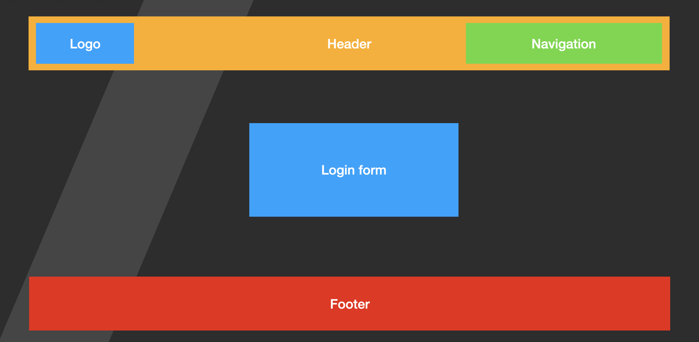

# EX Flexbox

## EX.

- create a new folder called `basic-layout`
- open vscode in the folder you created
- create a new file `index.html`
- add bootstrap cdn to you `index.html` file
- create also a `css` file and add it to the `index.html` file
- in that file create the following layout

